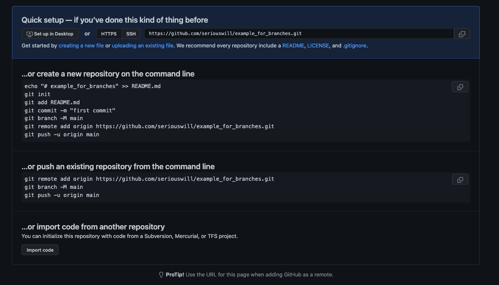
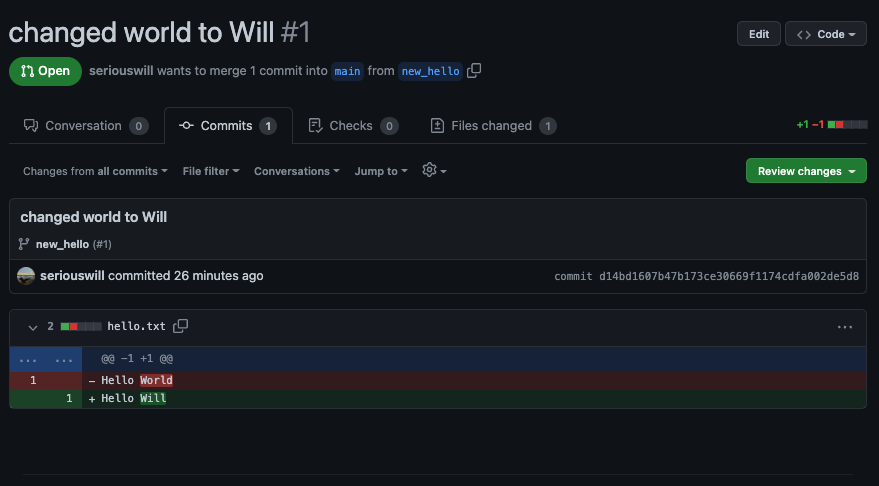

# GIT Branches

So you've been asked to make a new "branch" using GIT, and furthermore you will be asked to open a "Pull Request" in order to continue with the Peer Review element of the course.

What do these things mean, exactly? And why do we need to use them?

For the answers to all those pesky questions and more - this is the guide you're looking for!

## Branches? 

Yes! Branches are the names we give to slightly different versions in our version control. It helps us visualise our changes from one version to another when working on code - and is actually much easier to describe with images.

This is what it looks like if we make 5 commits on the `main` branch:


Whilst this is fine - and we do have a sort of version control running (if we made a serious error in the 4th circle - we could roll back to the third), this isn't really that great for working collaboratively.

If multiple people all worked on the `main` branch at the same time, their changes would get overwritten by each other!

This is where it might be helpful to open a second (or even a third!) branch.


Here we can see anyone working on `new_feature` can work independently from anyone working on `second_page` - this way these teams don't break each others code, and certainly don't break the main codebase!

This is what we are aiming to do when use the GIT branches. We can see how many branches we have open by running the `git branch` command (we hit the `q` button to quit):

```
; git branch
--- list of branches ---
main
--- the end ---
;q 
```

If we want to make a new branch we can by running the `git branch <name_of_branch>` command.

Try it!

```
; git branch great_git_branch_name
; git branch
```

## Exercise

In this exercise we are going to see the difference that occurs when we switch branches.

In your project folder in your terminal, follow along with these commands to make a new folder and open it in VSCode:

```
; mkdir git_branch_example
; cd git_branch_example 
; git init
```

This will have now made a new GIT repository inside your new `git_branch_example` folder. If you have set up your terminal with `OhMyZsh` you might see `git:(main)` after your folder name in the terminal.

```
; echo "Hello World" > hello.txt
; ls 
-> hello.txt
; code .
```

This `code .` then opens the entire directory in VSCode. Now we have to add and commit our changes (creating hello.txt).

```
; git add .
; git commit -m 'initial commit'
```

Now we are going to make a new branch and change some of the contents of `hello.txt`! We are going to call our new branch `new_hello`.

```
; git branch new_hello
; git switch new_hello
```

You may see the branch name changes in your terminal to signify you have switched branch!

Open `hello.txt` in VSCode and change `World` to your first name. Once that file is saved, we need to add and commit the changes to this new branch!

```
; git add .
; git commit -m 'changed the word World to Will'
```

With these changes now added and committed, with the text file open so you can see the magic - switch back to `main` - and back to `new_hello` - and back to `main` again!

```
; git switch main
; git switch new_hello
; git switch main
; git switch new_hello
```

We can observe the files contents changing from 'World' to your name!


## Real World Use

This is of course, only an example meant to illustrate how to navigate local branches. It serves as a good primer for your later use of branching when working in teams.

You will have to create many branches and work on them together across multiple machines when it comes to the group projects later on.

But how do we use branches that aren't local? How do we use access a codebase across multiple computers? With GitHub!

**Not to be confused with GIT** - which is a local (on your laptop) program, GitHub (along with many other Repository Services like Git Lab and Bit Bucket etc) helps you create and maintain an online version of GIT. On GitHub you can share code, make branches online, and work collaboratively without overwriting anyone's hard work.

One way we can do this, is by opening a Pull Request - this is what you're being asked to do (and leave constructive comments on!) for the Peer Code Review portion of this module.

Let's see how it works in action.


## Pull Requests and Comments

I've made a brand new repository on GitHub. It's completely fresh.



I can copy the commands that it gives me there to connect the **local** repo I was working on to make my `hello.txt` changes to my GitHub repo (make sure you are on the `main` branch when you do):

```
; git remote add origin https://github.com/seriouswill/example_for_branches.git
; git push -u origin main
```

We should see our nice little `hello.txt` uploaded. If we look to the left of where it says `main` on GitHub it will say there is only one branch. But hang on! We had two branches **locally**!

We would need to switch to our other branch, again, locally - and then push **that** branch to the GitHub repo.

```
; git switch new_hello
; git push -u origin new_hello
```

Then we should see a little yellow popup box above our GitHub online repository, telling us a new branch has been push and would we like to create a Pull Request to handle it:


If we click on the yellow box, it opens a new page in the Pull Requests tab on our GitHub repo.

We can then make a Pull Request, which compares the two versions of our repo, and thereby; all our code!

Luckily, for this example, the only difference is a single word so it'll be easy to spot!


If we click on the little 6 character commit address (highlighted in orange!) we can see the diff!



Fantastic!

And if we want to leave some helpful comments on our Peer Review feedback?


<!-- BEGIN GENERATED SECTION DO NOT EDIT -->

---

**How was this resource?**  
[😫](https://airtable.com/shrUJ3t7KLMqVRFKR?prefill_Repository=makersacademy%2Fruby_foundations&prefill_File=GIT_BRANCH_GUIDANCE.md&prefill_Sentiment=😫) [😕](https://airtable.com/shrUJ3t7KLMqVRFKR?prefill_Repository=makersacademy%2Fruby_foundations&prefill_File=GIT_BRANCH_GUIDANCE.md&prefill_Sentiment=😕) [😐](https://airtable.com/shrUJ3t7KLMqVRFKR?prefill_Repository=makersacademy%2Fruby_foundations&prefill_File=GIT_BRANCH_GUIDANCE.md&prefill_Sentiment=😐) [🙂](https://airtable.com/shrUJ3t7KLMqVRFKR?prefill_Repository=makersacademy%2Fruby_foundations&prefill_File=GIT_BRANCH_GUIDANCE.md&prefill_Sentiment=🙂) [😀](https://airtable.com/shrUJ3t7KLMqVRFKR?prefill_Repository=makersacademy%2Fruby_foundations&prefill_File=GIT_BRANCH_GUIDANCE.md&prefill_Sentiment=😀)  
Click an emoji to tell us.

<!-- END GENERATED SECTION DO NOT EDIT -->
