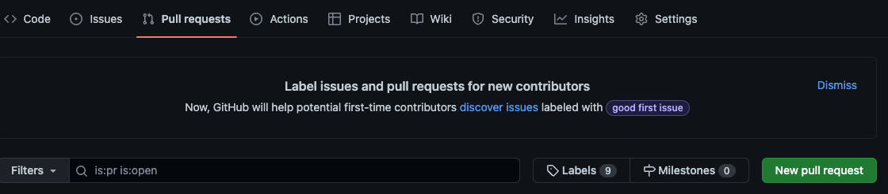

# Peer Review

In Agile teams, you will find that lots of the work that gets done between the team members has shared responsibility. This is to allow for flexibility and efficiency.

One of these key tasks within an Agile team is, Code Review.

Code Review is an important aspect of a Developers workflow. Not only does it allow for catching bugs and logical errors; it strengthens the reviewer's ability to evaluate and improve their own code. 

This in turn facilitates skill-set development and alleviates the pressure around learning new technologies.

This also lessens the amount of functionality that rests entirely on one persons shoulders. It creates cross team visibility and accessibility.

## What To Look Out For

Depending on the code you are reviewing, you might be looking for any number of things, whether they be simple program requirements, or complex integration functionalities. This will vary depending on the project and technologies, but generally, here are some things a code reviewer may want to be on the lookout for:

- Logical errors
    - Are there any human errors in the logic? 
    - Does some functionality look as though its side effects could cause errors?
    - Could this logic be implemented more easily, more concisely or more clearly?

- Requirements analysis
    - Does the file, code or program meet the intended requirements?
    - Are there any unintended results?
    - Does the program or code do more than it ought to?
    - Could the code be refactored to achieve the desired outcome more efficiently?

- Readability and accessibility
    - Is the code formatted well; is it easy to read?
    - Could the code be reformatted or refactored to improve accessibility?
    - Is the code documented well, or is there good design documentation in place?

- Testing
    - Does the code pass the tests already in place?
    - Do the tests need to change to accommodate changes in the code?
    - If the tests are being reviewed - do they test for all cases being implemented?

## Giving it a go

We are going to ask you to have a go at reviewing one of your peer's challenges.

We can do this by using GIT. We'll give you a link to a pull request made by your peer. You are to go through the code, leaving comments on the appropriate lines. This will then give them an opportunity to amend their submission.

Once both parties are satisfied, the Pull Request would normally be merged. But not this time. A coach will have a look at both the code and the code review.

==If you are struggling with branches== you can find the [GIT Branch Guidance Document here](./GIT_BRANCH_GUIDANCE.md) 

## Checklists

To give you a good head start, and begin building your critical analysis, we've built a checklist of items for you to tick off as you review each submission.

[Challenge One - Password Validator](https://github.com/makersacademy/ruby_challenges/blob/main/ruby_chapter_1_challenges/program/CHECKLIST.md)

Challenge Two - Password Manager 1.0, will be reviewed by your Technical Coach.

[Challenge Three - Password Manager 2.0](https://github.com/makersacademy/ruby_challenges/blob/main/ruby_chapter_3_challenges/program/CHECKLIST.md)

## Making a Pull Request

On your GitHub repo for the challenge submission, you should have made a new branch for your work. If you didn't, the code you wrote for the challenge may only be a small part of the changes you made on the branch you worked on. That will make finding that specific code harder. But it can still be done. Learn from this experience and try to make future changes in a new branch.

Push your changes to your github repo. (If you have forgotten how to do that, look up staging, committing and push/pull [here](https://github.com/makersacademy/basic-programming#phase-two-git-version-control))

Then you will be able to make a new pull request. You can navigate to `Pull Requests` here:

When you make a new pull request, you have to choose two branches to compare. Select the main branch of the Makers repo as the base and your branch name on your github repo as the `compare` branch.

Leave a comment if you like. Make sure that the title is something to describe what you have done. And then create the pull request.

**Don't MERGE the branch until you re both happy that there is no more changes to be made**

If you're reviewing *or* your code is being reviewed, please take a screenshot (`cmd + shift + 4` on a mac) of the Pull Request comments.

Once you're both happy and the changes have been merged to the main branch, take a screenshot or save the browser page as a PDF (sometimes this option is available when printing). Upload your copy of the PR via the form.

<!-- BEGIN GENERATED SECTION DO NOT EDIT -->

---

**How was this resource?**  
[😫](https://airtable.com/shrUJ3t7KLMqVRFKR?prefill_Repository=makersacademy%2Fruby_foundations&prefill_File=PEER_REVIEW.md&prefill_Sentiment=😫) [😕](https://airtable.com/shrUJ3t7KLMqVRFKR?prefill_Repository=makersacademy%2Fruby_foundations&prefill_File=PEER_REVIEW.md&prefill_Sentiment=😕) [😐](https://airtable.com/shrUJ3t7KLMqVRFKR?prefill_Repository=makersacademy%2Fruby_foundations&prefill_File=PEER_REVIEW.md&prefill_Sentiment=😐) [🙂](https://airtable.com/shrUJ3t7KLMqVRFKR?prefill_Repository=makersacademy%2Fruby_foundations&prefill_File=PEER_REVIEW.md&prefill_Sentiment=🙂) [😀](https://airtable.com/shrUJ3t7KLMqVRFKR?prefill_Repository=makersacademy%2Fruby_foundations&prefill_File=PEER_REVIEW.md&prefill_Sentiment=😀)  
Click an emoji to tell us.

<!-- END GENERATED SECTION DO NOT EDIT -->
